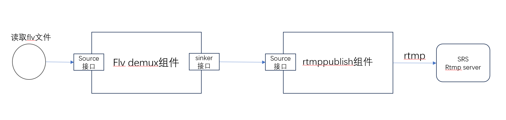

# 读取flv文件做rtmp推流开发示例
## 1. 简介
cpp streamer是音视频组件，提供串流方式开发模式，可以理解成gstreamer的C++版本。


读取flv文件做rtmp推流的实现，使用两个组件:
* flvdemux组件
* rtmppublish组件

实现如下图



* 先读取flv文件
* 使用flvdemux组件：source接口导入文件二进制流，解析后，通过sinker接口输出视频+音频的媒体流；
* 使用rtmppublish组件: source接口导入上游解析后的媒体流后，组件内部进行rtmp网络传输格式的封装，再通过网络发送给rtmp服务器(如srs服务)；

## 2. 代码开发实现
代码实现在: src/tools/flv2rtmppublish_streamer.cpp

### 2.1 cpp streamer组件接口简介
每个媒体组件，都采用接口类来访问，如下:
```
class CppStreamerInterface
{
public:
    virtual std::string StreamerName() = 0;
    virtual void SetLogger(Logger* logger) = 0;
    virtual int AddSinker(CppStreamerInterface* sinker) = 0;
    virtual int RemoveSinker(const std::string& name) = 0;
    virtual int SourceData(Media_Packet_Ptr pkt_ptr) = 0;
    virtual void StartNetwork(const std::string& url, void* loop_handle) = 0;
    virtual void AddOption(const std::string& key, const std::string& value) = 0;
    virtual void SetReporter(StreamerReport* reporter) = 0;
};
```
* StreamerName: 返回字符串，唯一的组件名
* SetLogger: 设置日志输出，如果不设置，组件内部不产生日志；
* AddSinker：加入组件输出的下一跳接口；
* RemoveSinker：删除组件输出的下一跳接口；
* SourceData：组件接受上一跳传来数据的接口；
* StartNetwork：如果是网络组件，如rtmp，webrtc的whip，需要输入url，开始网络协议的运行；
* AddOption：设置特定的选项；
* SetReporter：设置组件上报消息的接口，如组件内部错误信息，或网络组件传输媒体流的bitrate，帧率等信息；

# 2.2 创建组件
创建组件代码，[详细代码flv2rtmppublish_streamer.cpp](../src/tools/flv2rtmppublish_streamer.cpp)
```
class Flv2RtmpPublishStreamerMgr : public CppStreamerInterface, public StreamerReport
{
    int MakeStreamers() {
        CppStreamerFactory::SetLogger(s_logger);//设置日志输出
        CppStreamerFactory::SetLibPath("./output/lib");//设置组件动态库的路径
    
        flv_demux_streamer_ = CppStreamerFactory::MakeStreamer("flvdemux");//创建flvdemux的组件
        flv_demux_streamer_->SetLogger(logger_);//设置模块日志输出
        flv_demux_streamer_->SetReporter(this);//设置消息报告
        
        rtmppublish_streamer_ = CppStreamerFactory::MakeStreamer("rtmppublish");//创建rtmppublish组件
        rtmppublish_streamer_->SetLogger(logger_);//设置模块日志输出
        rtmppublish_streamer_->SetReporter(this);//设置消息报告
        rtmppublish_streamer_->StartNetwork(dst_url_, loop_handle);//设置rtmp目的url和libuv网络loop句柄

        //设置flvdemux组件的下一跳为rtmppublish组件
        flvdemux_streamer_->AddSinker(rtmppublish_streamer_);
        return 0;
    }
}
```

# 2.3 flv文件输入
文件读取:
```
    uint8_t read_data[2048];
    size_t read_n = 0;
    do {
        read_n = fread(read_data, 1, sizeof(read_data), file_p);
        if (read_n > 0) {
            streamer_mgr_ptr->InputFlvData(read_data, read_n);
        }
    } while (read_n > 0);
```
文件通过flvdemux组件的sourceData接口输入：
```
    int InputFlvData(uint8_t* data, size_t data_len) {
        Media_Packet_Ptr pkt_ptr = std::make_shared<Media_Packet>();
        pkt_ptr->buffer_ptr_->AppendData((char*)data, data_len);

        flv_demux_streamer_->SourceData(pkt_ptr);//导入flv数据
        return 0;
    }
```

