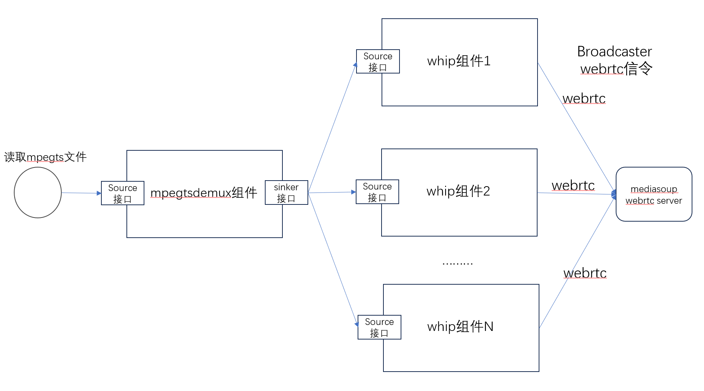

# 读取mpegts文件做mediasoup broadcaster推流bench压测开发示例
## 1. 简介
cpp streamer是音视频组件，提供串流方式开发模式。

读取mpegts文件做mediasoup broadcaster推流的实现，使用两个组件:
* mpegtsdemux组件
* mspush组件: mediasoup push推流组件

压测启动多个mspush组件实例，并发进行推流，并发模式采用libuv的单线程异步高并发模式。

本例实现的webrtc的mediasoup broadcaster推流，https的路径和服务端是针对mediasoup的webrtc服务实现，信令采用mediasoup broadcaster。

实现如下图



* 先读取mpegts文件
* 使用mpegtsdemux组件：source接口导入文件二进制流，解析后，通过sinker接口输出视频+音频的媒体流；
* 使用mspush组件: source接口导入上游解析后的媒体流后，组件内部进行webrtc网络传输格式的封装，再通过网络发送给webrtc服务器，这里为mediasoup的webrtc服务，用mediasoup broadcaster信令协商后，在用mspush组件进行推流；
* 启动多个mspush组件实例，同时想webrtc服务进行推流；

### 1.1 srs的mediasoup broadcaster url格式
```
https://xxxxx.com:4443?roomId=200&userId=1000
```
如上：

http方法: post

http 参数: roomId=200&userId=1000, 注意roomId和userId两个参数都是必须的

### 1.2 执行命令行
```
./mediasoup_push_bench -i webrtc.ts -o "https://xxxxx.com:4443?roomId=200&userId=1000" -n 100
```

注意：
* 输出的地址组要加引号。
* -n 为并发mediasoup broadcaster session个数
* mpegts文件，编码格式必须是：视频h264 baseline；音频opus 采样率48000，通道数为2；

推荐生成mpegts源文件的ffmpeg命令行: 
```
ffmpeg -i src.mp4 -c:v libx264 -r 25 -g 100 -profile baseline -c:a libopus -ar 48000 -ac 2 -ab 32k -f mpegts webrtc.ts
```

### 1.3 mediasoup服务端源码的缺陷与修改
mediasoup broadcaster接口是对我提供https api做信令交换。

但是其有前提：<b> 推流所在的roomId必须提前存在，否则broadcaster创建失败</b>

所以，需要修改mediasoup-demo的源码server.js:
```
    expressApp.param(
        'roomId', (req, res, next, roomId) =>
        {
            queue.push(async () =>
                {
                    consumerReplicas = 0;
                    req.room = await getOrCreateRoom({ roomId, consumerReplicas });
                    next();
                }).catch((error) =>
                        {
                            logger.error('room creation or room joining failed:%o', error);
 
                            reject(error);
                        });
        });
```

原有代码：在http api检测roomId的房间是否存在，若不存在，拒绝创建broadcaster;

新代码: 在http api检测roomId的房间是否存在，若不存在，创建该roomId的新房间;

## 2. 代码开发实现
代码实现在: [src/tools/mediasoup_push_bench.cpp](../src/tools/mediasoup_push_bench.cpp)

### 2.1 cpp streamer组件接口简介
每个媒体组件，都采用接口类来访问，如下:
```
class CppStreamerInterface
{
public:
    virtual std::string StreamerName() = 0;
    virtual void SetLogger(Logger* logger) = 0;
    virtual int AddSinker(CppStreamerInterface* sinker) = 0;
    virtual int RemoveSinker(const std::string& name) = 0;
    virtual int SourceData(Media_Packet_Ptr pkt_ptr) = 0;
    virtual void StartNetwork(const std::string& url, void* loop_handle) = 0;
    virtual void AddOption(const std::string& key, const std::string& value) = 0;
    virtual void SetReporter(StreamerReport* reporter) = 0;
};
```
* StreamerName: 返回字符串，唯一的组件名
* SetLogger: 设置日志输出，如果不设置，组件内部不产生日志；
* AddSinker：加入组件输出的下一跳接口；
* RemoveSinker：删除组件输出的下一跳接口；
* SourceData：组件接受上一跳传来数据的接口；
* StartNetwork：如果是网络组件，如rtmp，webrtc的whip，需要输入url，开始网络协议的运行；
* AddOption：设置特定的选项；
* SetReporter：设置组件上报消息的接口，如组件内部错误信息，或网络组件传输媒体流的bitrate，帧率等信息；

# 2.2 创建组件
创建组件代码，[详细代码mediasoup_push_bench.cpp](../src/tools/mediasoup_push_bench.cpp)
```
class Mpegts2MediaSoupPushs: public StreamerReport, public TimerInterface
{
    int MakeStreamers() {
        CppStreamerFactory::SetLogger(s_logger);//设置日志输出
        CppStreamerFactory::SetLibPath("./output/lib");//设置组件动态库的路径

        tsdemux_streamer_ = CppStreamerFactory::MakeStreamer("mpegtsdemux");//创建mpegtsdemux的组件
        tsdemux_streamer_->SetLogger(logger_);//设置模块日志输出
        tsdemux_streamer_->AddOption("re", "true");//设置flv的demux按照媒体流的时间戳来进行解析输出
        tsdemux_streamer_->SetReporter(this);//设置消息报告
 
        //创建多个mediasoup broadcaster压测实例
        for (size_t i = 0; i < bench_count_; i++) {
            //创建mediasoup push组件
            CppStreamerInterface* mediasoup_pusher = CppStreamerFactory::MakeStreamer("mspush");
            mediasoup_pusher->SetLogger(logger_);//设置模块日志输出
            mediasoup_pusher->SetReporter(this);//设置消息报告
            tsdemux_streamer_->AddSinker(mediasoup_pusher);//设置mpegtsdemux组件的下一跳为mspush组件

            mediasoup_pusher_vec.push_back(mediasoup_pusher);
        }

        return 0;
    }

    //启动定时器，每次启动几个mspush实例
    void StartWhips() {
        size_t i = 0;
        for (i = whip_index_; i < whip_index_ + WHIPS_INTERVAL;i++) {
            if (i >= bench_count_) {
                break;
            }
            std::string url = GetUrl(i);
            //设置mediasoup broadcaster目的url和libuv网络loop句柄，并开始mediasoup session
            mediasoup_pusher_vec[i]->StartNetwork(url, loop_);
        }
        whip_index_ = i;
        if (whip_index_ >= bench_count_) {
            post_done_ = true;
        }
    }
}
```

# 2.3 mpegts文件输入
文件读取:
```
        uint8_t read_data[10*188];
        size_t read_n = 0;
        do {
            read_n = fread(read_data, 1, sizeof(read_data), file_p);
            if (read_n > 0) {
                InputTsData(read_data, read_n);
            }
            if (!whip_ready_) {
                LogErrorf(logger_, "whip error and break mpegts reading");
                break;
            }
        } while (read_n > 0);
```
文件通过mpegtsdemux组件的sourceData接口输入：
```
    int InputTsData(uint8_t* data, size_t data_len) {
        Media_Packet_Ptr pkt_ptr = std::make_shared<Media_Packet>();
        pkt_ptr->buffer_ptr_->AppendData((char*)data, data_len);
        tsdemux_streamer_->SourceData(pkt_ptr);
        return 0;
    }
```

